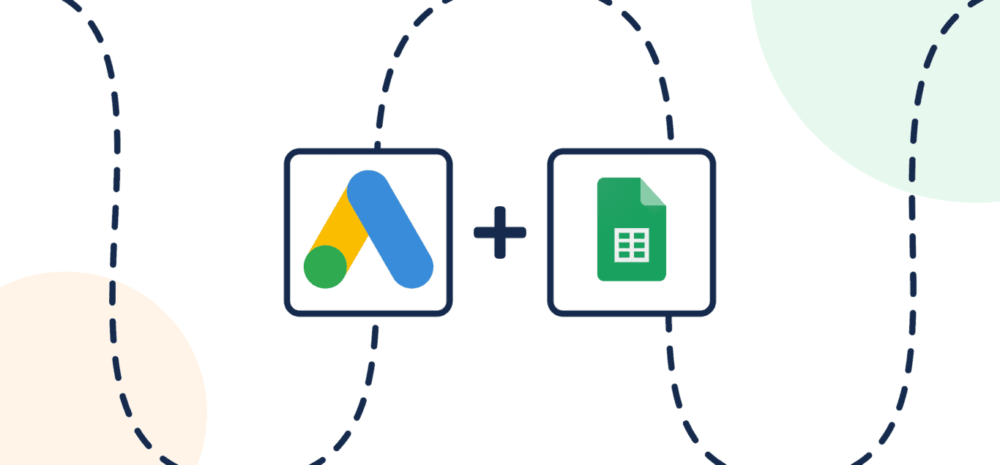

<a name="top"></a>

<div align="center">
    
    <h1>Google Ads Data Scraper & Automation</h1>
    
</div>

> [!IMPORTANT]
> This repository provides two methods to **extract Google Ads data** and store it in **Google Sheets** for automated daily recording.


## **Methods**
1. **Google Ads API (Python)** → Best for full control & external automation.
2. **Google Ads Scripts (JavaScript)** → Best for quick automation within Google Ads Manager.

---

## **1. Google Ads API (Python)**
### **Overview**
This method fetches Google Ads data using the **Google Ads API** and stores it in a Google Sheet.

### **Requirements**
- A **Google Ads Developer Token**
- A **Google Cloud Project** with API access
- A **Google Ads Account**
- Python 3.x and the following libraries:
  ```bash
  pip install google-ads gspread oauth2client
  ```

### **Setup Instructions**
1. Enable Google Ads API
- Sign up for a Google Ads Developer Token: Google Ads API Center
- Enable API access in Google Cloud Console.
- Generate OAuth credentials and download `credentials.json`.
2. Update Google Ads API Configuration
- In your working directory, create a `google-ads.yaml` file:
```
developer_token: "YOUR_DEVELOPER_TOKEN"
client_id: "YOUR_CLIENT_ID"
client_secret: "YOUR_CLIENT_SECRET"
refresh_token: "YOUR_REFRESH_TOKEN"
```
3. Run the Script
```
from google.ads.google_ads.client import GoogleAdsClient
import gspread
from oauth2client.service_account import ServiceAccountCredentials

# Load Google Ads client
client = GoogleAdsClient.load_from_storage("google-ads.yaml")
customer_id = "123-456-7890"

# Query Google Ads data
query = """
SELECT campaign.id, campaign.name, metrics.impressions, metrics.clicks, metrics.cost_micros
FROM campaign
WHERE segments.date DURING LAST_7_DAYS
"""
response = client.service.google_ads.search(customer_id=customer_id, query=query)

# Google Sheets Setup
scope = ["https://spreadsheets.google.com/feeds", "https://www.googleapis.com/auth/drive"]
creds = ServiceAccountCredentials.from_json_keyfile_name("credentials.json", scope)
gs_client = gspread.authorize(creds)
sheet = gs_client.open("Google Ads Data").sheet1

# Append data to Google Sheets
for row in response:
    sheet.append_row([row.campaign.id.value, row.campaign.name.value, row.metrics.impressions.value, row.metrics.clicks.value, row.metrics.cost_micros.value])
print("Data updated in Google Sheets.")
```
4. Automate Daily Execution
- Use **Google Cloud Scheduler**, **cron job**, or **Task Scheduler** to run the script daily.

<p align="right"><a href="#top">back to top</a></p>

## **2. Google Ads Scripts (JavaScript)**
### **Overview**
This method runs a Google Ads Script inside Google Ads Manager to fetch data and store it in a Google Sheet.

### **Setup Instructions**
1. Go to Google Ads Manager
- Navigate to Tools & Settings > Scripts.
- Click + New Script.
2. Copy & Paste the Script
```
function main() {
    var spreadsheetUrl = "YOUR_GOOGLE_SHEET_URL";
    var sheet = SpreadsheetApp.openByUrl(spreadsheetUrl).getActiveSheet();
    
    var report = AdsApp.report(
        "SELECT CampaignName, Clicks, Impressions, Cost " +
        "FROM CAMPAIGN_PERFORMANCE_REPORT " +
        "DURING LAST_7_DAYS");

    var rows = report.rows();
    while (rows.hasNext()) {
        var row = rows.next();
        sheet.appendRow([row.CampaignName, row.Clicks, row.Impressions, row.Cost]);
    }
}
```
3. Save & Authorize the Script
- Click **Authorize** when prompted.
- Run the script to test data retrieval.
4. Schedule Daily Automation
- Click **Create Schedule** in Google Ads Scripts.
- Set it to run **once per day**.

<p align="right"><a href="#readme-top">back to top</a></p>

## **Comparison Table**
| Feature | Google Ads API (Python) | Google Ads Scripts (JavaScript) |
| :- | :- | :- |
| Difficulty | Medium | Easy
| Customization | High | Limited
| Requires Google Cloud Setup |	✅ Yes | ❌ No
| Runs Outside Google Ads | ✅ Yes | ❌ No
| Runs Inside Google Ads | ❌ No	| ✅ Yes
| Best For | Developers who need advanced reports | Marketers who want quick automation

<p align="right"><a href="#readme-top">back to top</a></p>

## **Contributing**
Feel free to submit pull requests or report issues if you find any improvements.

## **License**
This project is licensed under the MIT License.

<p align="right"><a href="#readme-top">back to top</a></p>